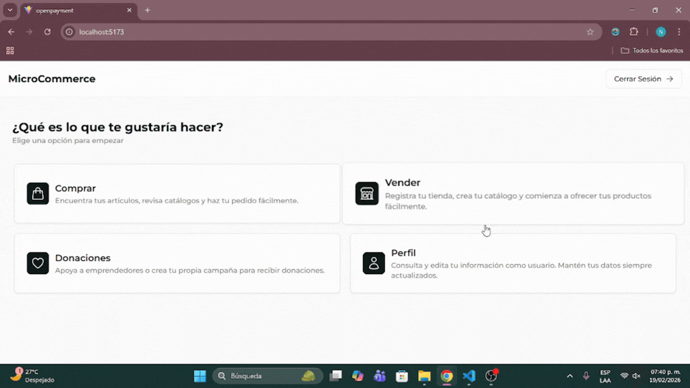
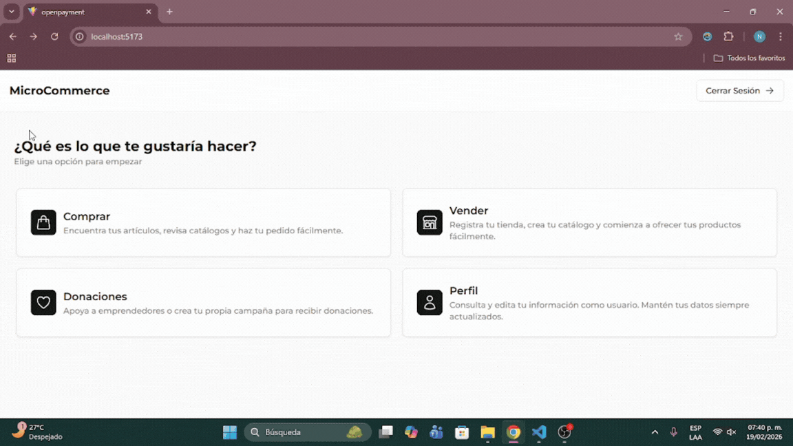
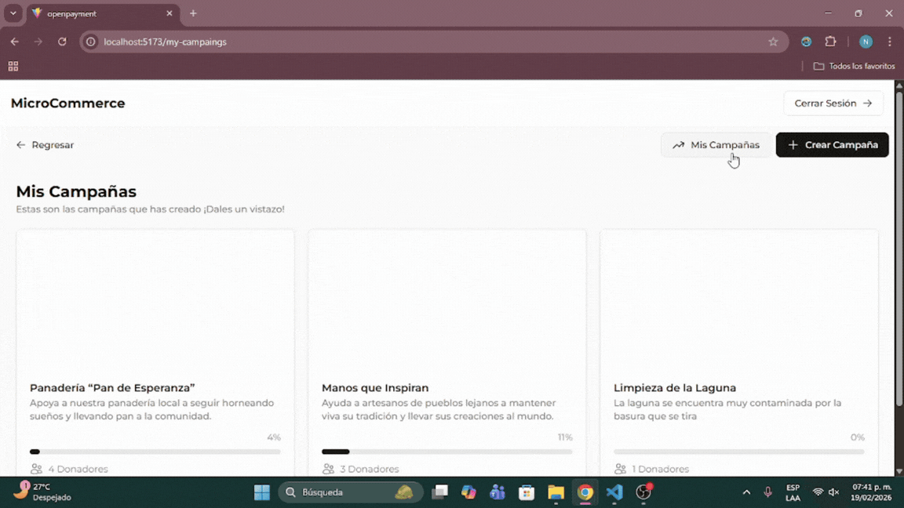

# 🛒 Aretécne Microcommerce (Hackathon Interledger - 2025)

Frontend del prototipo **Aretécne Microcommerce**, desarrollado durante el Hackathon Interledger 2025 en un sprint intensivo de 24 horas.  
Este repositorio contiene la implementación **frontend completa del flujo de fondeo** y la preparación visual del módulo de microcommerce.

🔗 Repositorio backend: https://github.com/rvjosecarlos/aretecne_back

---

## 🏆 Contexto

Proyecto desarrollado durante el **Hackathon Open Payments 2025 (Interledger)**, programando durante 24 horas continuas en equipo.

---

## 👥 Equipo

👨‍💻 **Jose Carlos Reynoso Vera**  
Full Stack JavaScript Developer (MERN/PERN) | Construyendo apps con React, Node.js y TypeScript
https://github.com/rvjosecarlos

👩‍💻 **Nicole Rosas Vallejo**  
Desarrolladora Fullstack (MERN / PERN) con enfoque en Frontend  
https://github.com/rvnicole

---

## 🎯 Objetivo del Frontend

Diseñar e implementar una interfaz clara e intuitiva que permita a los usuarios:

- Registrarse y vincular su wallet Open Payments  
- Explorar campañas de microemprendedores  
- Crear, editar y gestionar campañas propias  
- Realizar donaciones interoperables usando Open Payments  
- Visualizar información de usuario y campañas  

---

## 🛠 Stack Tecnológico

- React
- Vite
- TypeScript
- Tailwind CSS
- React Router DOM
- Axios
- Zustand (estado global)

---

## ⚙️ Arquitectura Frontend

Estructura modular orientada a escalabilidad:

- `pages/` → vistas principales  
- `components/` → componentes reutilizables  
- `api/` → consumo de endpoints  
- Estado global con **Zustand** (datos del usuario autenticado)
- Navegación con **React Router DOM**

---

## 📸 Capturas

---

## 🔄 Integración con Backend

El frontend consume la **API REST** desarrollada en Node.js y Express, integrando los flujos de pago implementados con **Open Payments (Interledger)**.

### Endpoints integrados funcionalmente:
- Registro de usuario con URL de wallet  
- Login  
- Obtener todas las campañas  
- Obtener campaña específica (vista detallada y donación)  
- Crear campaña  
- Editar campaña  
- Obtener campañas propias  
- Flujo completo de donación con Open Payments  

---

## ✨ Funcionalidades Implementadas

- Registro de usuarios con vinculación de wallet Open Payments  
- Autenticación (login)  
- Listado de campañas de microemprendedores  
- Creación, edición y gestión de campañas propias  
- Vista detallada de campaña  
- Donaciones interoperables con Open Payments  
- Vista de información del usuario  
- Estado global para manejo de sesión  

---

## 🚧 Funcionalidades No Terminadas

Durante el hackathon se priorizó el flujo de **fondeo**, por lo que el módulo de microcommerce quedó **parcialmente preparado**:

- Menú para:
  - Crear tienda  
  - Subir productos  
  - Gestionar pedidos  
  - Comprar productos  
- ❌ No se desarrollaron vistas, UI ni lógica para estas secciones  
- ✔️ La lógica completa de microcommerce fue implementada a nivel **backend**

---

## 🧠 Aprendizajes

Este proyecto fortaleció habilidades en:

- Integración frontend–backend en tiempo real  
- Consumo de APIs fintech interoperables  
- Trabajo bajo presión en entornos intensivos  
- Coordinación técnica en equipo durante hackathons  

---

## 📌 Nota

Este repositorio representa el estado del frontend **al cierre del hackathon** y sirve como base para continuar el desarrollo del módulo completo de microcommerce.
